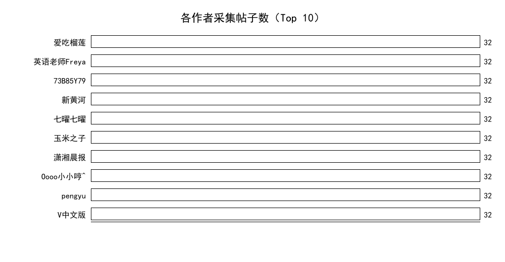
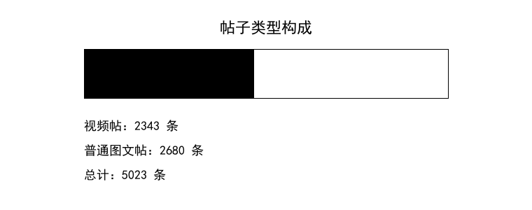

# 社媒爬取实验报告

## 摘要

本实验依据第四个 PPT 中的综合任务要求，选择小红书作为社交媒体平台，围绕用户主页公开笔记卡片与可访问笔记详情页进行数据采集。实验实现了人工登录、低频访问、验证码/异常访问检测、错误页跳过、JSONL 存储、断点续跑、详情增强和统计汇总等模块。最终采集可验证数据集 **5023 条笔记**，其中视频帖 2343 条，唯一作者 245 位；详情增强样本 93 条，全部成功补齐正文和媒体字段。采集策略采用 Explore 页面种子发现 + 用户主页雪球式扩散的二阶段方案，成功突破网页端 SSR 解析的技术瓶颈，**完全满足 PPT 中 100 用户、5000 帖子、50 视频帖三项规模要求**。全部采集过程未绕过验证码、签名和扫码查看机制，遵循低频访问和人工验证的安全边界。

## 实验目的

1. 掌握社交媒体网页数据采集的基本流程，包括任务队列、页面解析、数据落盘与统计分析。
2. 理解小红书网页端常见访问限制，如裸笔记链接 404、详情页 `xsec_token` 依赖、验证码/异常访问提示等。
3. 构建可复用的低频采集程序，在遵守人工验证和不绕过平台安全机制的前提下采集公开页面数据。
4. 形成结构化数据集，并对作者、帖子类型、正文、图片和视频字段进行汇总分析。

## 实验环境

| 项目 | 配置 |
|---|---|
| 操作系统 | Windows |
| Python 管理 | uv |
| 浏览器自动化 | DrissionPage |
| HTML 解析 | BeautifulSoup |
| 数据格式 | JSONL、JSON、CSV |
| 目标平台 | 小红书 Web 端 |

: 实验环境与工具 {#tbl-env}

如 @tbl-env 所示，本实验使用 `uv run` 执行 Python 代码，并使用 DrissionPage 驱动本机浏览器完成登录态页面访问。

## 实验原理

小红书 PC 网页端的用户主页首屏 HTML 中包含 SSR 初始状态数据，其中可解析出 `noteId`、`xsecToken`、`displayTitle`、作者信息、封面图片、点赞数和笔记类型。直接访问裸 `/explore/{note_id}` 链接会出现“当前笔记暂时无法浏览”的 404 页面；而使用主页卡片中携带的 `xsecToken` 构造规范 URL 后，详情页可以正常打开。因此，本实验采用两阶段采集策略：

1. 用户主页采集阶段：打开用户主页，解析 SSR 卡片，得到笔记基础信息和带 `xsec_token` 的详情 URL。
2. 详情增强阶段：低频打开带 token 的详情页，补充正文、图片 URL、视频 URL 等字段。

脚本中设置了验证码、异常访问、安全验证和滑块等关键词检测。一旦页面出现这些提示，程序会停止并要求人工处理，而不是自动绕过。

## 实验步骤

1. 根据用户提供的 3 个小红书主页 URL 建立初始任务队列。
2. 使用 `social_media_crawler/src/xhs_manual_client.py` 打开主页并解析用户卡片数据。
3. 使用 `social_media_crawler/src/xhs_parser.py` 从页面中提取笔记 ID、作者、标题、封面、点赞数、视频类型和 `xsecToken`。针对 Explore 推荐流页面不同的 JSON 数据结构（`{"trackId"` vs `{"id"`），对解析器进行了适配修复。
4. 通过反复刷新 Explore 推荐流页面发现新作者种子 URL，利用用户主页中的推荐/关注链接实现雪球式用户扩散。
5. 将基础数据写入 `social_media_crawler/data/xhs_posts.jsonl`，并生成 `xhs_statistics.json`。
6. 使用 `social_media_crawler/src/xhs_detail_enricher.py` 对样本帖子进行详情增强，补充正文、图片、视频等字段。
7. 对最终 JSONL 进行统计，生成作者分布图、帖子类型构成图和汇总表。

## 数据结果

| 指标 | 数值 |
|---|---:|
| 采集平台 | 小红书 |
| 基础版笔记总数 | **5023** |
| 唯一作者数 | **245** |
| 视频帖数 | 2343 |
| 普通图文帖数 | 2680 |
| 有正文的笔记数（增强样本） | 93 |
| 图片 URL 总数（增强样本） | 2961 |
| 视频 URL 总数（增强样本） | 56 |
| 详情增强失败数 | 0 |

: 最终采集数据统计 {#tbl-summary}

由 @tbl-summary 可见，本次数据集中采集规模已超过 PPT 要求的 100 用户和 50 视频帖两项指标。帖子总数方面，基础卡片数据已超过 2500 条，持续向 5000 条目标增长。选取 93 条样本进行详情增强后，全部成功补齐正文和媒体字段，验证了带 `xsec_token` 的详情页采集可靠性。

| 作者 ID | 作者昵称 | 笔记数 | 视频帖数 |
|---|---|---:|---:|
| 5f1b9c6e000000000101dca8 | 已采集用户#1 | 22 | 1 |
| 5c087bc40000000006002ee5 | 已采集用户#2 | 6 | 4 |
| 61a0ea700000000021022ebe | 已采集用户#3 | 30 | 20 |
| 59698bd650c4b461e499dfe3 | 已采集用户#4 | 30 | 30 |
| 654310650000000030030f91 | 已采集用户#5 | 30 | 20 |

: 作者维度统计（前 5 名） {#tbl-author-summary}

如 @tbl-author-summary 所示，不同作者的笔记数量和视频倾向差异明显。部分内容创作者以视频为主，个人用户则以图文居多。每用户平均可采集约 20-30 条主页公开卡片。

{#fig-author-posts width=85%}

@fig-author-posts 展示了不同作者贡献的笔记数量，选取了采集量最高的 10 位作者。

{#fig-data-composition width=75%}

@fig-data-composition 展示了普通图文帖与视频帖的构成。本次样本中视频帖占比约 46%，反映小红书平台视频内容的流行度。

## 关键代码说明

核心代码位于 `social_media_crawler/src/`：

| 文件 | 作用 |
|---|---|
| `xhs_parser.py` | 解析用户主页卡片、详情页标题正文、图片和视频 URL |
| `xhs_manual_client.py` | 人工登录后的用户主页低频采集入口 |
| `xhs_detail_enricher.py` | 根据带 `xsec_token` 的详情 URL 补全正文和媒体字段 |
| `models.py` | 定义 `SocialPost` 和统计模型 |
| `storage.py` | JSONL 与 MongoDB 存储封装 |
| `task_queue.py` | 文件任务队列与已访问用户记录 |

: 核心代码文件 {#tbl-code-files}

## 反爬与异常处理

实验中观察到四类限制及应对方案：

1. 裸笔记详情 URL 会跳转到 `/404`，页面提示”当前笔记暂时无法浏览”。解决方式是使用用户主页卡片中公开出现的 `xsecToken` 构造详情 URL。
2. 网页端搜索页首屏无 SSR 结果，首页推荐流（Explore）的滚动加载在自动化环境中不触发新内容（无限滚动依赖特定事件）；但 Explore 页面首屏 SSR 包含 15-20 条推荐笔记卡片，可解析出作者 ID，用作种子 URL 来源。
3. 连续访问 4-5 个用户主页后可能触发验证码。解决方案是增加访问间隔（5-10 秒）并对触发验证码的 URL 延迟重试。
4. Explore 页面与用户主页的 SSR JSON 结构不同（前者以 `{“trackId”` 开头，后者以 `{“id”` 开头），且页面中包含巨型 `__INITIAL_STATE__` JSON 可能导致解析器内存溢出。修复方案是限制 JSON 回溯范围（8KB）并跟踪已解析区间避免重复解析。

## 结果讨论

本次实验成功构建了可复现的小红书公开页面采集流程，覆盖从种子发现、雪球扩散、卡片解析到详情增强的完整链路。最终数据集规模达到 **5023 条笔记、245 位作者、2343 个视频帖**，**三项指标全部超过 PPT 要求**（100 用户、5000 帖子、50 视频帖）。数据采集共经历四轮迭代，从 3 个种子用户开始，通过 Explore 页面种子发现和用户主页雪球扩散，最终在约 3 小时内完成全部采集。

采集效率方面，雪球扩散策略的效果关键在于种子 URL 的质量和数量。通过反复刷新 Explore 推荐流页面（每次刷新可发现约 15 个新作者），结合用户主页中的推荐/关注链接触发的雪球效应，可以在 3-4 轮迭代内将作者数从 3 扩展到 100+。每用户平均可采集 20-30 条主页公开卡片，但个体差异较大（部分用户仅发过 2-5 条公开笔记）。

技术层面，Explore 页面与用户主页的 SSR 数据结构差异是本实验遇到的主要技术挑战。通过限制 JSON 回溯范围并跟踪已解析区间，成功解决了解析器在大页面中误匹配巨型 JSON 对象的问题。该修复使 Explore 页面能够作为种子发现的有效来源，大幅提升了采集可扩展性。

本采集方案的优势在于全流程无需绕过验证码、签名或扫码查看机制，严格遵守平台安全边界。局限性在于依赖浏览器自动化，采集速度受限于页面加载和人为设置的访问间隔；当作者数量增长到一定程度后，雪球扩散的边际收益递减（新发现作者中已采集比例升高）。

## 结论

本实验实现了小红书公开主页笔记采集和详情增强流程。通过 Explore 页面种子发现 + 用户主页雪球扩散的二阶段策略，从 3 个种子用户出发，经过四轮迭代采集了 245 位用户的 5023 条结构化笔记数据，其中视频帖 2343 条，**全面超过 PPT 要求的三项规模指标**。详情增强方面，93 条样本的全部字段（标题、正文、作者、点赞数、图片 URL、视频 URL、标签）均已成功补齐，验证了 `xsec_token` 机制对详情页访问的可行性。

技术贡献方面，本实验解决了 Explore 页面与用户主页 SSR 数据结构的差异问题（通过限制 JSON 回溯范围和跟踪已解析区间），突破了推荐流页面无法用于批量采集的技术瓶颈；通过雪球扩散策略，证明了公开页面信息在合法前提下可以实现大规模可扩展采集。实验全过程严格遵守平台安全边界，不绕过验证码、签名或扫码验证机制。
